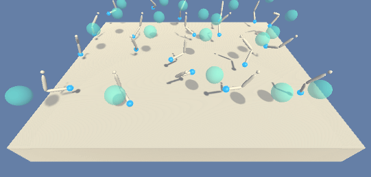
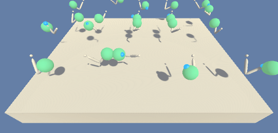

# Deep Reinforcement Learning - Continuous Control

### Introduction

This project solves the Unity [Reacher](https://github.com/Unity-Technologies/ml-agents/blob/master/docs/Learning-Environment-Examples.md#reacher) environment.

**Random Agent**



**Trained Agent**



In this environment, a double-jointed arm can move to target locations. A reward of +0.1 is provided for each step that the agent's hand is in the goal location. Thus, the goal of the agent is to maintain its position at the target location for as many time steps as possible.

The observation space consists of 33 variables corresponding to position, rotation, velocity, and angular velocities of the arm. Each action is a vector with four numbers, corresponding to torque applicable to two joints. Every entry in the action vector should be a number between -1 and 1.

### Distributed Training

The solution in this project, can work with two separate versions of the Unity environment:
- The first version contains a single agent.
- The second version contains 20 identical agents, each with its own copy of the environment.  

The second version is useful for algorithms like [PPO](https://arxiv.org/pdf/1707.06347.pdf), [A3C](https://arxiv.org/pdf/1602.01783.pdf), and [D4PG](https://openreview.net/pdf?id=SyZipzbCb) that use multiple (non-interacting, parallel) copies of the same agent to distribute the task of gathering experience.  

However, the environment was solved using a [Deep Deterministic Policy Gradients (DDPG)](https://arxiv.org/abs/1509.02971) algorithm adapted to work with multiple agents.

### Solving the Environment

Here the results are only presented for the Option 2 of the environment, but the implementation works with Option 1 as well.

#### Option 1: Solve the First Version

The task is episodic, and in order to solve the environment,  your agent must get an average score of +30 over 100 consecutive episodes.

#### Option 2: Solve the Second Version

The barrier for solving the second version of the environment is slightly different, to take into account the presence of many agents.  In particular, the agents must get an average score of +30 (over 100 consecutive episodes, and over all agents).  Specifically,
- After each episode, we add up the rewards that each agent received (without discounting), to get a score for each agent.  This yields 20 (potentially different) scores.  We then take the average of these 20 scores. 
- This yields an **average score** for each episode (where the average is over all 20 agents).

The environment is considered solved, when the average (over 100 episodes) of those average scores is at least +30. 

### Getting Started

The repository contains a Python package `drl_ctrl` that has command line interface to show
a demo with a trained agent or to use a Random agent. 

**Important Notice:**
The DDPG agent was trained with using PyTorch 1.4.0 (due to need for CUDA10 to use local GPU).
However, the version `unityagents` is 0.4.0. Both `pytorch` and `unityagents` packages are required,
but were omitted from requirements in `setup.py` to prevent installation from PyPi.

To run the trained or random agent, clone this repository with `git` install with `pip` as usual:

```shell script
git clone https://github.com/daraliu/drl-continuous-control
pip install -e drl-continuous-control
```

1. Download the environment from one of the links below.  You need only select the environment that matches your operating system:

    - **_Version 1: One (1) Agent_**
        - Linux: [click here](https://s3-us-west-1.amazonaws.com/udacity-drlnd/P2/Reacher/one_agent/Reacher_Linux.zip)
        - Mac OSX: [click here](https://s3-us-west-1.amazonaws.com/udacity-drlnd/P2/Reacher/one_agent/Reacher.app.zip)
        - Windows (32-bit): [click here](https://s3-us-west-1.amazonaws.com/udacity-drlnd/P2/Reacher/one_agent/Reacher_Windows_x86.zip)
        - Windows (64-bit): [click here](https://s3-us-west-1.amazonaws.com/udacity-drlnd/P2/Reacher/one_agent/Reacher_Windows_x86_64.zip)

    - **_Version 2: Twenty (20) Agents_**
        - Linux: [click here](https://s3-us-west-1.amazonaws.com/udacity-drlnd/P2/Reacher/Reacher_Linux.zip)
        - Mac OSX: [click here](https://s3-us-west-1.amazonaws.com/udacity-drlnd/P2/Reacher/Reacher.app.zip)
        - Windows (32-bit): [click here](https://s3-us-west-1.amazonaws.com/udacity-drlnd/P2/Reacher/Reacher_Windows_x86.zip)
        - Windows (64-bit): [click here](https://s3-us-west-1.amazonaws.com/udacity-drlnd/P2/Reacher/Reacher_Windows_x86_64.zip)
    
    (_For Windows users_) Check out [this link](https://support.microsoft.com/en-us/help/827218/how-to-determine-whether-a-computer-is-running-a-32-bit-version-or-64) if you need help with determining if your computer is running a 32-bit version or 64-bit version of the Windows operating system.

    (_For AWS_) If you'd like to train the agent on AWS (and have not [enabled a virtual screen](https://github.com/Unity-Technologies/ml-agents/blob/master/docs/Training-on-Amazon-Web-Service.md)), then please use [this link](https://s3-us-west-1.amazonaws.com/udacity-drlnd/P2/Reacher/one_agent/Reacher_Linux_NoVis.zip) (version 1) or [this link](https://s3-us-west-1.amazonaws.com/udacity-drlnd/P2/Reacher/Reacher_Linux_NoVis.zip) (version 2) to obtain the "headless" version of the environment.  You will **not** be able to watch the agent without enabling a virtual screen, but you will be able to train the agent.  (_To watch the agent, you should follow the instructions to [enable a virtual screen](https://github.com/Unity-Technologies/ml-agents/blob/master/docs/Training-on-Amazon-Web-Service.md), and then download the environment for the **Linux** operating system above._)

2. Place the file the root folder of this GitHub repository, and unzip (or decompress) it. 

### Instructions


The path to a binary in the extracted environment has to be provided in [Reacher20-Continuous-Control.ipynb](https://github.com/daraliu/drl-continuous-control/blob/master/notebooks/Reacher20-Continuous-Control.ipynb) Jupyter notebook for training
and as a command line option if using the `drl-ctrl demo-reacher20` command.

### Training

The agent final agent is trained using [Reacher20-Continuous-Control.ipynb](https://github.com/daraliu/drl-continuous-control/blob/master/notebooks/Reacher20-Continuous-Control.ipynb) Jupyter notebook which contains the best hyper parameters found during hyper parameter tuning.

The notebook [Reacher20-DDPG-tuning.ipynb](https://github.com/daraliu/drl-continuous-control/blob/master/notebooks/Reacher20-DDPG-tuning.ipynb) contains raw results from hyper parameter tuning and 
the notebook [Reacher20-tuning-summary.ipynb](https://github.com/daraliu/drl-continuous-control/blob/master/notebooks/Reacher20-tuning-summary.ipynb) summarized hyper parameter tuning results.

The detailed report on the approach is provided [here](https://github.com/daraliu/drl-continuous-control/blob/master/Report.md).

### Demo

Once the package is installed, `drl-ctrl` command group becomes available with
the command `demo-reacher20` to run a demo with trained of Random agent.

```
» drl-ctrl demo-reacher20 --help
Usage: drl-ctrl demo-reacher20 [OPTIONS] [DIR_MODEL]

  Run a demo of 20 Reacher agents - trained or random (if no model provided) 

Options:
  -e, --unity-reacher20-env FILE  Path to Unity Reacher20 Environment
                                  executable
  --help                          Show this message and exit.
```

Trained model weights located `training_output/best_agent_so_far/weights.pth` after cloning the repository.


Trained model weights located `training_output/best_agent/weights_actor.pth` and 
`training_output/best_agent/weights_critic.pth` after cloning the repository. 
Whe running the demo through command line interface, the directory `training_output/best_agent` 
should be provided as `DIR_MODEL`.


